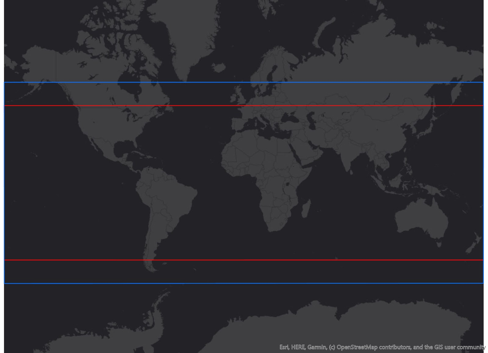

# Other

## Gro Crop Masks

### Introduction
Gro's proprietary high resolution crop masks are currently used in the [Gro yield models](https://gro-intelligence.com/products/gro-analytics). These have proven very successful i.e. more accurate for yield modeling than the best available alternatives. Gro does not plan on developing a yield model for every crop or region in the world, so our models will always be limited to the regions and crops where we can help push the envelope. Our crop masks are not yet directly available to users in the Gro web app and the API, but will be very soon!

### Methodology
__Crop masks for past seasons:__
In order to remove irrelevant data pixels (i.e., pixels that are not representative of the crop in study), we create/derive crop specific masks for each past crop season, as [described here](https://www.gro-intelligence.com/blog/want-to-build-a-yield-model-heres-your-first-step) (see also [Creating a basic customizable framework for crop detection using Landsat imagery](https://www.tandfonline.com/doi/abs/10.1080/2150704X.2016.1252471)). This is necessary for each year, due to crop rotations and other changes in the area where crops are planted. Moreover, even with per-season masks, there is an additional challenge for in-season crop yield forecasting, because the current season crop mask is usually not available until the beginning of the following year.

__In-season crop mask:__
For current season forecasting, since we're starting well before the growing period, there is no universal approach that provides the best mask. Instead, we use the series of masks for prior seasons to create a few different masks for the current season. Together, these current season masks can be thought of as providing supersets and subsets of the true planted area. The combination of the various masks provides the information needed for yield forecasting purposes.

For any mask, the following current season masks are created:

* a __low-confidence__ version is created by an OR of the years, i.e., choosing pixels that have been the crop in question for at least one year in the history of the cropland data layers. In other words, the low-confidence mask answers the question "was the crop planted here in 2000 or in 2001 or in 2002 ...". This can be thought of as an upper bound of the true area. Or equivalently, for each pixel, a prediction with high recall and low precision.

* a __high-confidence__ mask version is created by an AND of the years, i.e., selecting pixels that have always been the crop in question over the entire history of the prior season masks, so long as that region has been in the data layers. In other words, it answers the question "was the crop planted here in 2000 and in 2001 and in 2002 …" This it can be seen as a lower bound of the true area. Or equivalently, for each pixel, a prediction with low recall and high precision.

Additional refinements:

* a __clumped__ version is obtained by removing clusters with a total number of fewer than 8 pixels.

### US Corn
Yearly corn masks (binary) were extracted from USDA NASS Cropland Data Layers (CDL) for the US Corn Belt, which includes 10 states: Illinois, Indiana, Iowa, Kansas, Minnesota, Missouri, Nebraska, Ohio, South Dakota, and Wisconsin, from 1999 to 2015. Note that not all states were covered in the yearly masks prior to 2008 due to growing coverage of NASS CDL from 1999 to 2008.

In-season masks:

A low-confidence mask and a high-confidence mask were made from those yearly crop masks. Each of them was further clumped to remove erroneous pixels, which gave us two more static corn masks.

* [low confidence](https://s3.amazonaws.com/groprod/gro_crop_masks/us_corn/USCorn_LC_99_15.tif)
* [high confidence](https://s3.amazonaws.com/groprod/gro_crop_masks/us_corn/USCorn_HC_99_15.tif)
* [low confidence clumped](https://s3.amazonaws.com/groprod/gro_crop_masks/us_corn/USCorn_LCClump_99_15.tif)
* [high confidence clumped](https://s3.amazonaws.com/groprod/gro_crop_masks/us_corn/USCorn_HCClump_99_15.tif)

### US Soy
Yearly soy masks were extracted from the NASS CDL the same way as corn, except that the entire contiguous US was included. In this case we end up using only one mask:

In-season masks:

* [low confidence](https://s3.amazonaws.com/groprod/gro_crop_masks/us_soy/USSoy_LC_08_17.tif) was made from yearly masks for 2008 to 2017.

We start in 2008, because including years prior to 2008 reduces the accuracy for yield modeling purposes. A high-confidence mask is not used, as it was found to not help the yield modeling accuracy. Both of these observations seem to reflect the fact that, in the US, the areas where soybeans are planted have been changing relatively more than the corn areas, which makes older crop masks less informative in this case.

### Argentina Soy
Argentina does not have an equivalent of the US CDL data, so annual soybean masks had to be created by Gro. These masks were created annually and ranged from 2007-2016 using the following methodology.

The signals for classification of soy in Argentina were from optical sensors from Landsat 5, 7, and 8 along with Sentinel-2. First, a set of false color images were created from the shortwave infrared (SWIR ~1.62µm) band, near infrared (NIR ~0.85µm) band, and visible red (Red ~0.66µm) band. which were temporally classified using the crop calendars in Gro for the primary season of soybean production over the country. These were divided into two images, one taking the median pixel value over the time period that planting occurred and the other taking the median pixel value over the time period when growth occurred. The false color image was created. This was done because studies have shown that SWIR-NIR-Red false color composites accurately discriminate between vegetation, soil, and water due to the spectral properties of the channels.

After this was completed, the false color images were transformed from a normal RGB (Red-Green-Blue) color space into a Hue-Saturation-Value (HSV) color space where the Hue band is subsequently isolated. By isolating the Hue pixel values, we solve the problems resulting from variations in brightness level (owed to the Value) and chromatic modulation (from the Saturation) from pixel to pixel. By doing this the Hue pixel values identified as soil generally range on the low end of pixel values while vegetation accounts for the middle range with water taking up the high end range. By subtracting the vegetation hue layer from the soil hue layer and isolating the top portion of the pixel values (pixels greater than or equal to 0.14), what’s left is an image that highlights areas which were soil during the planting phase and vegetation during the growth phase. Those areas are inclined to only be crops during those specific times during the crop cycle (i.e., forests, grasslands, and pastures tend to not change in sync with the cropland) although it is not yet know what specific crops they are, only that their growth cycle matches that of the crop cycle given in the crop calendars.

Once those unidentifiable crops have been found, a simple ratio was used to identify soy from other crops. For the case of soy, we use a simple ratio of: SWIR/Red values from the growing season, where SWIR represents the shortwave infrared band (~1.62µm) and Red represents the red band in the visible spectrum (~0.66µm). High values of this simple ratio were shown to be very distinctive at identifying soy when validated against the NASS Cropland Data Layers in the US.

A low-confidence mask and a high-confidence mask were made from those yearly crop masks. Each of them were further clumped to remove erroneous pixels, which gave us two more static soy masks.

In-season masks:

* [low confidence](https://s3.amazonaws.com/groprod/gro_crop_masks/argentina_soy/ArgLC07_16.tif)
* [high confidence](https://s3.amazonaws.com/groprod/gro_crop_masks/argentina_soy/ArgHC07_16.tif)
* [low confidence clumped](https://s3.amazonaws.com/groprod/gro_crop_masks/argentina_soy/ArgLC07_16Clumped.tif)
* [high confidence clumped](https://s3.amazonaws.com/groprod/gro_crop_masks/argentina_soy/ArgHC07_16Clumped.tif)

### India Wheat
Since India does not have the equivalent of NASS CDL available to the public, we use a technique similar to the one used for Argentina. The masks were also classified annually and span years 2007-2017. The methodology was refined slightly in three ways:

* Instead of using a single crop calendar for the entire country, crop calendars specific to individual states were used to create the planting and growth phase images. Subsequently, the corresponding years were mosaicked together before the creation of the confidence masks.
* The simple ratio of SWIR/Red was not used for the identification of wheat. Instead, when comparing images to CDL masks in the US the combination that most closely identified with wheat was the high end of Hue&ast;NDVI&ast;NDWI during the growth phase.
* The final change that was made was the addition of eliminating pixels that were on a slope that was greater than 10°.

A low-confidence mask and a high-confidence mask were made from those yearly crop masks. Each of them were further clumped to remove erroneous pixels, which gave us two more static wheat masks.

In-season masks:

* [low confidence](https://s3.amazonaws.com/groprod/gro_crop_masks/india_wheat/IndiaWheat_07_17_LC_1b.tif)
* [high confidence](https://s3.amazonaws.com/groprod/gro_crop_masks/india_wheat/IndiaWheat_07_17_HC_1b.tif)
* [low confidence clumped](https://s3.amazonaws.com/groprod/gro_crop_masks/india_wheat/IndiaWheat_07_17_LC_ClumpDual.tif)
* [high confidence clumped](https://s3.amazonaws.com/groprod/gro_crop_masks/india_wheat/IndiaWheat_07_17_HC_ClumpDual.tif)

## Gro Yield Model Backtest Data

### Introduction
[Gro yield models](https://gro-intelligence.com/products/gro-analytics) provide live forecasts for crops in different regions around the world. To supplement our in-depth papers on the models, we provide backtesting data for model evaluation and comparisons.

### File Formats
For each crop-region pair for which we have a yield model, we provide two csv files for each day in the crop season.

1. national level backtest:
* file name is of the following format: {DATE}_backtesting_national_{CROP}_{REGION}.csv
* columns in the file are:
	* year: market year of the backtested prediction
	* pred: yield prediction at the country level of that year
	* unit_id: unit_id that the prediction is in. You can look up the unit by using `client.lookup('units', input_unit_id)` function.
2. regional level backtest
* granularity varies among models
* file name is of the following format: {DATE}_backtesting_{CROP}_{REGION}.csv
* columns in the file are:
	* year: market year of the backtested prediction
	* region_id: Gro region id that this prediction is for. You can look up the region by using `client.lookup('regions', region_id)` function.
	* pred: yield prediction of that region in that year
	* unit_id: Gro unit id that the prediction is in. You can look up the unit by using `client.lookup('units', input_unit_id)` function

### Download the Data by Model
__Models__
Listed below are Gro's existing models. Each available link will lead you to backtest data (daily frequency) for a whole crop season.

* [US Corn](https://s3.amazonaws.com/groprod/yield_model_backtest/US_corn_backtest_2001_to_2017.zip)
* [US Soybeans](https://s3.amazonaws.com/groprod/yield_model_backtest/US_soybeans_backtest_2001_to_2017.zip)
* [Argentina Soybeans](https://s3.amazonaws.com/groprod/yield_model_backtest/Argentina_soybeans_backtest_2001_to_2017.zip)
* [India Wheat](https://s3.amazonaws.com/groprod/yield_model_backtest/India_wheat_backtest_2001_to_2017.zip)
* Ukraine Wheat (Beta)
* Russia Wheat (Beta)
* [US Hard Red Winter Wheat (Beta)](https://s3.amazonaws.com/groprod/yield_model_backtest/US_hardRedWinterWheat_backtest_2001_to_2018.zip)

NOTE: Our "beta" models have run for less than one full season. At this stage, each model has been fully backtested at monthly frequency across a whole crop season. However, the beta models are still under active development, so the inputs and parameters to the models might change during the current season.

## Radio Frequency Interference Effects On SMOS
The attached document details the effect that Radio Frequency Interference (RFI) has on the soil moisture source [SMOS](https://app.gro-intelligence.com/#/dictionary/sources/43): [radio-frequency-interference-smos.pdf](https://github.com/gro-intelligence/api-client/wiki/radio-frequency-interference-smos.pdf)

## TRMM and GPM spatial extents
Spatial extent for geospatial sources is the geographic region that is covered by that source. For the rainfall sources in Gro, it is important to know that the spatial extent is limited by their sources due to coverage limitations of the satellite platforms.

For [TRMM (3B42RT)](https://app.gro-intelligence.com/dictionary/sources/35), the spatial extent of the data is 50° north to 50° south (red bounding box below) due to the satellite’s coverage and the mission’s focus on tropical regions. While for [GPM (3IMERGDL)](https://app.gro-intelligence.com/dictionary/sources/126), the spatial extent of the data is 90° north to 90° south, however the “complete” version of the data only extends from 60° north to 60° south (blue bounding box below). This is because the “complete” version masks out observed passive microwave estimates over snowy/icy surfaces, so outside the latitude in the blue bounding box, where IR estimates are not available, precipitation estimates over non-snowy/icy surfaces are recorded as missing (1). This means that while Gro uses the 90° north to 90° south dataset, periodically data outside the 60° north to 60° south bounding box will not be reported.

(1) Huffman, G. J., Bolvin, D. T., & Nelkin, E. J. (2015). Integrated Multi-satellite Retrievals for GPM (IMERG) technical documentation. NASA/GSFC Code, 612(47), 2019.
