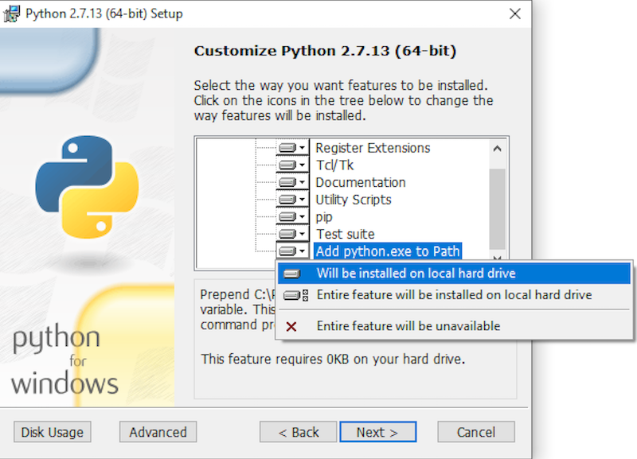

# Windows Prerequisites

The Gro API client is a standard python package, which can be installed on Windows with or without Anaconda. However, some popular data science packages, including some used in the sample scripts provided, are only available on Windows via [conda](https://docs.conda.io/en/latest/), for example [geopandas](http://geopandas.org/install.html). For that reason, we recommend using Anaconda on Windows.

## Anaconda (recommended)

1. Download Anaconda with Python 3.5 or above from [anaconda.com](https://www.anaconda.com/distribution/). Support for Python 2.7.13 or above is also maintained, but with [its End of Life](https://mail.python.org/pipermail/python-dev/2018-March/152348.html) soon approaching, it is recommended you start with Python 3. If you have an older version of Anaconda already installed,  run `conda install pip` to make sure it has pip installed.
2. Install Git from [git-scm.com](https://git-scm.com/download/win). Proceed with the default options.

## Non-Anaconda

1. Download Python version 3.5 or above from [python.org](https://www.python.org/downloads/windows/). Support for Python 2.7.13 or above is also maintained, but with [its End of Life](https://mail.python.org/pipermail/python-dev/2018-March/152348.html) soon approaching, it is recommended you start with Python 3.
2. Install both Python and pip to PATH either in the installer (enable component during the installation) or manually. The easiest way to do this is to make sure the below is checked during installation: 
3. Install Git from [git-scm.com](https://git-scm.com/download/win). Proceed with the default options.
